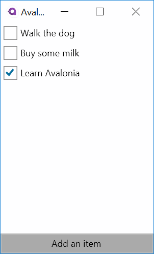
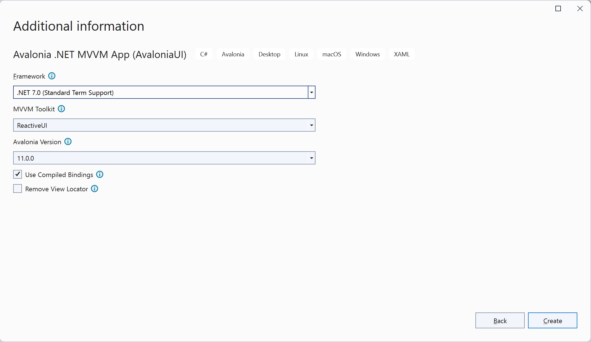
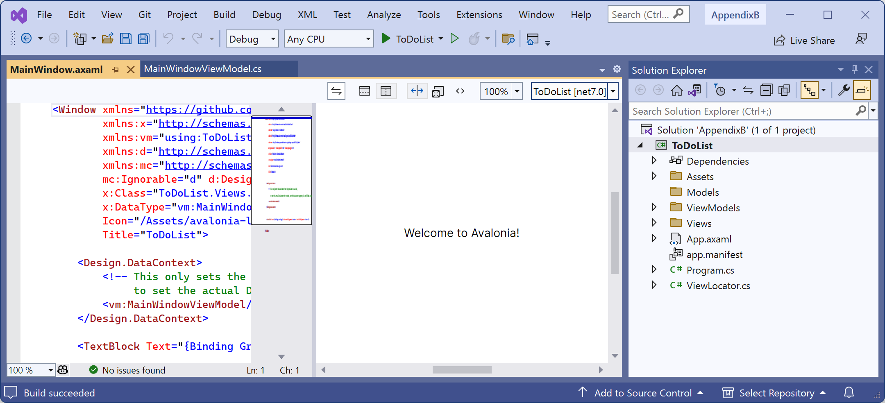

**Avalonia 11**

This page contains a tutorial based on the official [ToDo List tutorial](https://docs.avaloniaui.net/docs/next/tutorials/todo-list-app/) 
from Avalonia 11's documentation but with the issues fixed.

This tutorial contains step-by-step instructions using Visual Studio 2022 on Windows.

- [Introduction to the ToDo List app](#introduction-to-the-todo-list-app)
- [Install the Avalonia extension](#install-the-avalonia-extension)
- [Create a New Project](#create-a-new-project)
- [Create a New View](#create-a-new-view)
- [Main Window Content](#main-window-content)
- [Create a Model](#create-a-model)

# Introduction to the ToDo List app

In this tutorial you will create a simple to do list application using Avalonia UI and the Model View View-Model (MVVM) pattern with binding to the to do list (collection) data.

The final app will look like *Figure B.1*:



*Figure B.1: Avalonia ToDo List app*

# Install the Avalonia extension

1. In Visual Studio 2022, navigate to **Extensions** | **Manage Extensions**.
2. In the **Search box**, type `Avalonia`.
3. Select the **Avalonia for Visual Studio** extension and then click **Download**.
4. Follow the instructions (you will need to close Visual Studio while the VSIX installation runs).

# Create a New Project

1. In Visual Studio 2022, navigate to **File** | **New Project**.
2. In the **Create a new project** dialog box, in the **Search for templates** box, enter `avalonia`.
3. Select **Avalonia .NET MVVM App (AvaloniaUI)** and then click the **Next** button, as shown in *Figure B.2*:


*Figure B.2: Selecting the Avalonia .NET MVVM App (AvaloniaUI) project template*

4. In the **Configure your new project** dialog box, for the **Project name** enter `ToDoList`, for the **Location** select the `C:\apps-services-net8\` folder, for the **Solution name** enter `AppendixB`, and then click the **Next** button, as shown in *Figure B.3*:


*Figure B.3: Configuring your new project name and location*

5. In the **Additional information** dialog box, for **Framework** select **.NET 8.0 (Long Term Support)**, for **MVVM Toolkit** select **ReactiveUI**, for **Avalonia Version** select **11.0.0**, select the **Use Compiled Bindings** check box, clear the Remove View Locator check box, and then click the **Next** button, as shown in *Figure B.4*:



*Figure B.4: Providing additional information*

1. Note the `MainWindow.axaml` file is open but the designer is stuck loading, as shown in *Figure B.5*:


*Figure B.5: Designer stuck loading*

7. Navigate to **Build** | **Build ToDoList**.
8. After a few moments, note the designer finishes loading and shows a preview of the app, as shown in *Figure B.6*:



*Figure B.6: Designer showing a preview of the app*

# Create a New View

1. In **Solution Explorer**, right-click the `Views` folder.
2. Click **Add** | **New Item**.
3. In the **Add New Item** dialog box, in **C# Items**, select **Avalonia**, and then select **Avalonia UserControl (AvaloniaUI)**.
4. For **Name** enter `ToDoListView` and then click the **Add** button.
5. In the `ToDoListView.axaml` file, modify the contents to replace the `Welcome to Avalonia!` with a `<DockPanel>`, as shown in the following markup:
```xml
<UserControl xmlns="https://github.com/avaloniaui"
             xmlns:x="http://schemas.microsoft.com/winfx/2006/xaml"
             xmlns:d="http://schemas.microsoft.com/expression/blend/2008"
             xmlns:mc="http://schemas.openxmlformats.org/markup-compatibility/2006"
             mc:Ignorable="d" d:DesignWidth="250" d:DesignHeight="450"
             x:Class="ToDoList.Views.ToDoListView">
  <DockPanel>
    <Button DockPanel.Dock="Bottom"
            HorizontalAlignment="Stretch"
            HorizontalContentAlignment="Center">
        Add Item
    </Button>
    <StackPanel>
      <CheckBox Margin="4">Walk the dog</CheckBox>
      <CheckBox Margin="4">Buy some milk</CheckBox>
    </StackPanel>
  </DockPanel>
</UserControl>
```

6. Save the changes to the `.axaml` file.
7. Build the project and note the designer updates to show the new user interface, as shown in *Figure B.7*:


*Figure B.7: Designer showing a preview of the user control*

# Main Window Content

1. In the `Views` folder, in `MainWindow.axaml`, in the `<Window>` element, add a namespace decalration, as shown in the following markup: `xmlns:views="clr-namespace:ToDoList.Views"`.
2. In the `<Window>` element, change the title to `Avalonia To Do List`.
3. Replace the `<TextBlock>` with `<views:ToDoListView/>`.

The complete file should now look like this:
```xml
<Window xmlns="https://github.com/avaloniaui"
        xmlns:x="http://schemas.microsoft.com/winfx/2006/xaml"
        xmlns:vm="using:ToDoList.ViewModels"
        xmlns:d="http://schemas.microsoft.com/expression/blend/2008"
        xmlns:mc="http://schemas.openxmlformats.org/markup-compatibility/2006"
        mc:Ignorable="d" d:DesignWidth="800" d:DesignHeight="450"
        x:Class="ToDoList.Views.MainWindow"
        x:DataType="vm:MainWindowViewModel"
        xmlns:views="clr-namespace:ToDoList.Views"
        Icon="/Assets/avalonia-logo.ico"
        Title="Avalonia To Do List">

  <Design.DataContext>
    <!-- This only sets the DataContext for the previewer in an IDE,
             to set the actual DataContext for runtime, set the DataContext property in code (look at App.axaml.cs) -->
    <vm:MainWindowViewModel/>
  </Design.DataContext>

  <views:ToDoListView/>

</Window>
```

4. Save the changes to the file.
5. Build the project.
6. Start the project and note the main window now contains the user control with two check boxes, as shown in *Figure B.8*:


*Figure B.8: Running app with user control in main window*

# Create a Model

