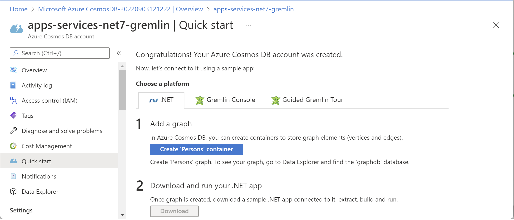
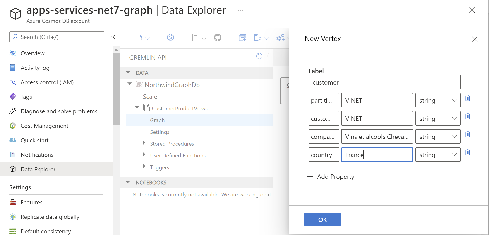
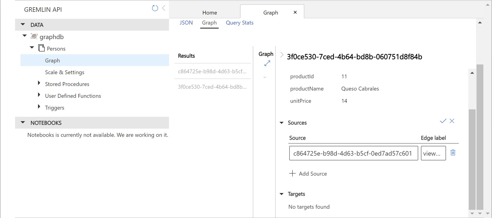
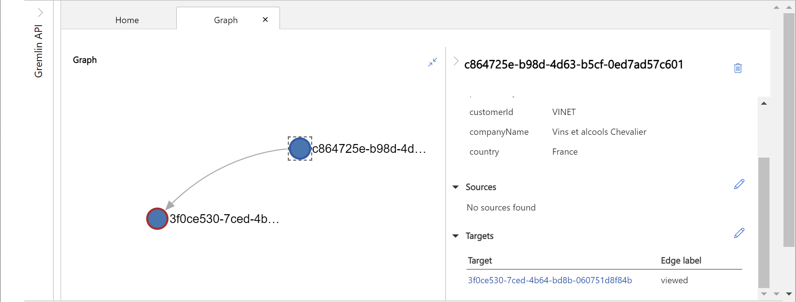
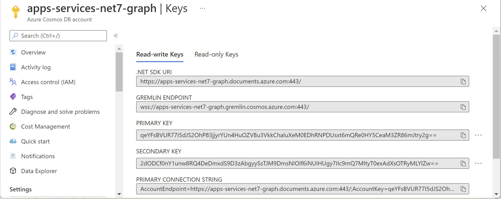
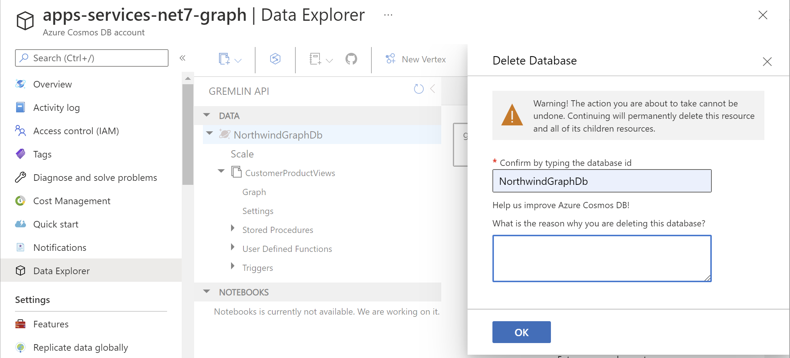
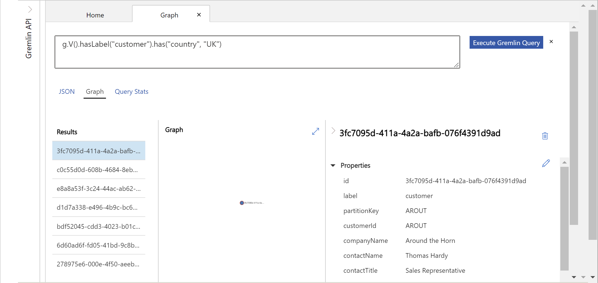
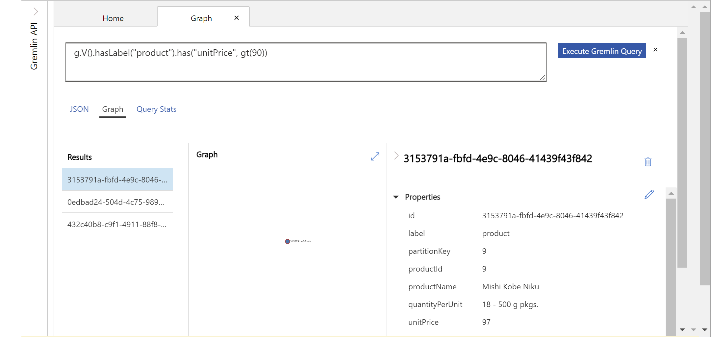

**Manipulating graph data with Gremlin API**

> This is an optional bonus section for *Chapter 4 Managing NoSQL Data Using Azure Cosmos DB*. It is not required to complete the rest of the book.

- [Comparing relational and graph databases](#comparing-relational-and-graph-databases)
- [Key terms for graph databases](#key-terms-for-graph-databases)
- [Defining a graph model using Gremlin API](#defining-a-graph-model-using-gremlin-api)
- [Traversing a graph](#traversing-a-graph)
- [Creating Azure resources for a graph database](#creating-azure-resources-for-a-graph-database)
- [Adding edges using Azure portal](#adding-edges-using-azure-portal)
- [Building a console app client for graph data](#building-a-console-app-client-for-graph-data)
- [Testing the console app](#testing-the-console-app)
- [Exercise 3.1A – Test your knowledge](#exercise-31a--test-your-knowledge)

The API for working with graph data in Azure Cosmos DB is Gremlin.

> The full documentation for Gremlin API can be found at the following link: https://docs.microsoft.com/en-us/azure/cosmos-db/graph/.

# Comparing relational and graph databases

Relational databases like SQL Server have a rigid schema. Tables like Products and Customers have columns to define the properties stored for each row. Tables can have relationships to other tables, and these are stored as part of the structure of the database. The performance of relational databases decreases with the number of relationships between tables.

For example, imagine an order from a French wine bar in the Northwind database. On paper, it might look something like this:

```
Order Number:    10248
Order Date:      July 4, 1996
Account Manager: Steven Buchanan

Paul Henriot, Accounting Manager
Vins et alcools Chevalier
59 rue de l'Abbaye
Reims 51100
France
Tel: 26.47.15.10

Product                        Unit Price  Quantity  Subtotal
Queso Cabrales                     $14.00        12   $168.00
Singaporean Hokkien Fried Mee       $9.80        10    $98.00
Mozzarella di Giovanni             $34.80         5   $174.00

                                              Total   $440.00

Shipped Date: July 16, 1996
Shipper:      Federal Shipping
```

To store this information in a relational database requires at least six related tables, as shown in the following partial tables.

**Orders** table:

| OrderId | OrderDate | CustomerId | EmployeeId | ShipVia | ShippedDate	| ... |
|---|---|---|---|---|---|---|
| 10248 | 04/07/1996 | VINET | 5 | 3 | 16/07/1996 | ... |

**Employees** table:

| EmployeeId | FirstName | LastName | ... |
|---|---|---|---|
| 5 | Steven | Buchanon | ... |

**Customers** table:

| CustomerId | CompanyName | ContactName | ContactTitle | ... |
|---|---|---|---|---|
| VINET | Vins et alcools Chevalier | Paul Henriot | Accounting Manager | ... |

**Shippers** table:

| ShipperId | CompanyName | Phone |
|---|---|---|
| 3 | Federal Shipping | (503) 555-9931 |

**Order Details** table:

| OrderId | ProductId | UnitPrice | Quantity | Discount
|---|---|---|---|---|
| 10248 | 11 | 14.0000 | 12 | 0 |
| 10248 | 42 | 9.8000 | 10 | 0 |
| 10248 | 72 | 34.8000 | 5 | 0 |

**Products** table:

| ProductId | ProductName | … |
|---|---|---|
| 11 | Queso Cabrales | … |
| 42 | Singaporean Hokkien Fried Mee | …
| 72 | Mozzarella di Giovanni | …

Graph databases like Azure Cosmos DB (graph) and MongoDB have no schemas. **Vertices** (aka nodes, nouns, objects, or entities) like `Products` and `Customers` can have any number of properties of any type. **Edges** (relationships that connect two vertices with a source and target) between vertices are also data. This provides more flexibility, and the edges can have their own properties. A product might belong to a category. A customer might have purchased a product on a date and paid an amount that used a discount. The performance of graph databases remains the same as relationship complexity increases.

A NoSQL or graph database could store all the information about an order in a single document. Graph databases also enable more modern scenarios. Instead of only storing information about orders for products, a digital commerce website might want to track interest in a product indicated by views of a product page on the website. An edge could be created between a registered or anonymous visitor and a product, including the date and time that they viewed the product page. Machine learning algorithms could process this edge data to provide automatic recommendations of products based on other customers’ viewing and purchasing habits.

The main con of graph databases is reduced performance when performing lots of transactions, or reduced performance of queries that touch data across the whole database.

# Key terms for graph databases

Let's review some key terms related to graph databases, as shown in *Figure 4A.1*:


*Figure 4A.1: Key terms related to graph databases*

*Figure 4A.1* shows a graph with two vertices with unique `id` values `1` and `2`. An edge connects the two vertices with a unique `id` `3`. Note that the edge has a direction, which goes out from vertex `1` and in to vertex `2`. From the perspective of the edge, vertex `1` is its **out vertex** and vertex `2` is its **in vertex**. As well as unique `id` values, vertices and edges also have **labels** to categorize them, like `Customer` and `Product`.

The `id` and `label` of a vertex or edge are mandatory. The `id` is often assigned automatically as a GUID value to avoid conflicts when two vertices with different labels might want to use the same value for an identifier. For example, a product and supplier with an `id` of 1. 

To support this, you can add custom properties to both vertices and edges, as shown in *Figure 4A.2*:

 
*Figure 4A.2: Custom properties for vertices and edges*

In the Northwind database, the customer named `Vins et alcools Chevalier` has a `customerId` of `VINET` but in this diagram I needed to illustrate a potential conflict if the mandatory id was set to duplicate values by using `customerId` and `productid`.

# Defining a graph model using Gremlin API

To add the two vertices and the edge shown in *Figure 3.16* to a graph named `g`, you could write the following code:

```js
v_out = g.addV("customer")
  .property("customerId", "VINET")
  .property("companyName", "Vins et alcools Chevalier")
  .property("country", "France")

v_in = g.addV("product")
  .property("productId", 11)
  .property("productName", "Queso Cabrales")
  .property("unitPrice", 14.0000)

g.addE("viewed").from(v_out).to(v_in)
  .property("weight", 0.4)
```

Note the following about the preceding code:

- When calling the `addV` function to add a vertex, you must specify a text value to use as the label.
- After calling the `addV` function, you call the property function to add each key-value pair for each property you want to add to the vertex.
- The code does not show it, but if the graph implementation allows it, you could assign the mandatory globally unique `id` value by calling the same property function, for example: `property("id", 1)`.
- The return value of the `addV` and chained property functions is a reference to the newly added vertex. This can be stored in a local variable.
- When calling the `addE` function to add an edge, you must specify the `from` and `to` vertices by calling those functions and passing a vertex reference to each.
- As with vertices, you call the property function to add each name-value pair for each property you want to add to the edge. A common property for an edge is a `weight` that could be used to calculate an importance to the relationship, or the cost of traversing the edge in time, money, or distance. It depends on what the graph is used for. For example, this value may increase if a customer views a product multiple times.

# Traversing a graph

Querying a graph is often called traversing because you can literally imagine yourself moving around the graph, from vertex to edge to vertex and so on.

Some basic traversals are shown in the following table:

| Traversal | Description
|---|---
| `g.V()` | Returns all the vertices in the graph g.
| `g.E()` | Returns all the edges in the graph g.
| `g.V().count()` | Returns the count of the number of vertices.
| `g.V().has('customerId', 'VINET')` | Returns the vertices that have a `customerId` of `VINET`.
| `g.V().hasLabel('customer').has('customerId', 'VINET')` | Returns the vertices that have a label of `customer` and a `customerId` of `VINET`.
| `g.V().has('customer', 'customerId', 'VINET')` | Returns the vertices that have a label of `customer` and a `customerId` of `VINET`.
| `g.V().has('customer', 'customerId', 'VINET').outE('viewed')` | Returns the edges with the label of `viewed` for the vertex with the label of `customer` with the `customerId` of `VINET`.
| `g.V().has('customer', 'customerId', 'VINET').outE('viewed').inV()` | Returns the `in` verticees for the edge with the label of `viewed` for the vertex with the label of `customer` with the `customerId` of `VINET`. In other words, it returns the `Queso Cabrales` product vertex in this example.
| `g.V().has('customer', 'customerId', 'VINET').out('viewed')` | An alternative equivalent to the above. By using `out` instead of `outE` it returns the vertex that the edge is going in. The `inV` is implied by not asking for the edge.
| `g.V().has('customer', 'customerId', 'VINET').out('viewed').values('productName')` | Returns the names of the products that the customer has viewed.
| `g.V().has('customer', 'country', 'France').order().by('city', decr)` | Returns customers in France sorted by city in decrementing (descending) order.
| `g.V().has('product', 'unitPrice', gt(10))` | Returns products that have a `unitPrice` greater than `10`.

# Creating Azure resources for a graph database

You must create a separate Azure Cosmos DB account for each API, so although you created an account to use Core (SQL) API, you will now create another account to explore Gremlin (Graph) API.

The Azure Cosmos DB Emulator supports the Core (SQL), Cassandra, MongoDB, Gremlin, and Table APIs. But currently the emulator's data explorer only supports Core (SQL) data. Gremlin (Graph) and other API data is not viewable (yet).

Now, let's use the Azure portal to create Cosmos DB graph resources like an account, database, and container in the cloud:

1.	Navigate to the Azure portal and sign in: https://portal.azure.com/
2.	In the Azure portal menu, click **+ Create a resource**.
3.	In the **Create a resource** page, search for or click **Azure Cosmos DB**.
4.	In the **Gremlin (Graph)** box, click the **Create** button.
5.	On the **Basics** tab:
    - Select your **Subscription**. Mine is named **Pay-As-You-Go**.
    - Select a **Resource Group** or create a new one. I used the name `apps-services-book`.
    - Enter an **Azure Cosmos DB Account Name**. I used `apps-services-book-graph`. Account names must be globally unique so you will have to use something different.
    - Select a **Location**. I chose **(Europe) UK West** as it is the closest to me.
    - Leave **Capacity mode** set to **Provisioned throughput**.
    - Set **Apply Free Tier Discount** to **Do not apply**. Only apply the discount if you want this account to be the only account within your subscription to be on the free tier. You might be better off saving this discount for another account that you might use for a real project, rather than a temporary learning account while reading this book.
    - Leave the **Limit total account throughput** check box selected.
6.	Click the **Review + create** button.
7.	Note the **Validation Success** message, review the summary, and then click the **Create** button.
8.	Wait for deployment to complete. This will take a few minutes.
9.	Click the **Go to resource** button and note that you might be directed to the **Quick Start** page with steps to follow to create a container and so on, depending on if this is the first time that you have created an Azure Cosmos DB account, as shown in *Figure 4A.3*:


*Figure 4A.3: Quick start page for a Gremlin API Azure Cosmos DB account*

10.	In the left navigation, click **Data Explorer**.
11.	Close the video popup window.
12.	In the toolbar, click **New Graph**, and fill in the properties, as shown in the following list:
    - Database id: `NorthwindGraphDb`
    - Database throughput: Autoscale
    - Graph id: `CustomerProductViews`
    - Partition key: `/partitionKey`
13.	Click **OK**.
14.	Expand **NorthwindGraphDb**, expand **CustomerProductViews**, and then click **Graph**.
15.	In the toolbar, click **New Vertex**.
16.	Fill in the properties for a customer vertex, as shown in the following bullets and in *Figure 4A.4*:
    - **Label**: `customer`
    - `partitionKey`: `VINET`
    - `customerId`: `VINET`
    - `companyName`: `Vins et alcools Chevalier`
    - `country`: `France`


*Figure 4A.4: Adding a new vertex*

17.	Click **OK**.
18.	In the toolbar, click **New Vertex**.
19.	Fill in the properties for a product vertex, making sure to set the appropriate data type for the number properties, as shown in the following bullets:
    - **Label**: `product`
    - `partitionKey`: `11` (number)
    - `productId`: `11` (number)
    - `productName`: `Queso Cabrales`
    - `unitPrice`: `14` (number)
20.	Click **OK**.

# Adding edges using Azure portal

To define an edge between the two vertices, we can either add a target to the customer or a source to the product. We will add a source to the product:

1.	In the graph, select the customer vertex and copy its `id` to the clipboard.
2.	In the graph, select the product vertex, scroll down to the bottom of its properties, and in the **Sources** section, click the pencil to start editing, paste the GUID in the **Source** box, enter `viewed` in the **Edge** label, as shown in *Figure 4A.5*:


*Figure 4A.5: Entering a source edge for the product vertex*

> Adding a `weight` property is a convention. It is not mandatory like `id`. If you want to add a `weight`, do so just like any other custom property.

3.	In the top-right corner of the **Sources** section, click the tick to save the changes.
4.	At top of the **Graph** tab, enter a query to request all the edges, `g.E()`, click the **Execute Gremlin Query** button, and note that the result should be a single edge coming out from the customer vertex and going in to the product vertex, as shown in the following JSON:

```json
[
  {
    "id": "48682b3d-26ca-4fe5-bd48-2f4fff7541c4",
    "label": "viewed",
    "type": "edge",
    "inVLabel": "product",
    "outVLabel": "customer",
    "inV": "3f0ce530-7ced-4b64-bd8b-060751d8f84b",
    "outV": "c864725e-b98d-4d63-b5cf-0ed7ad57c601"
  }
]
```

5.	Change the query back to `g.V()` and execute it to return to the full graph.
6.	Expand the graph area, select the customer vertex, show its properties, and note that it targets the product vertex because the arrow goes from the customer to the product, as shown in *Figure 4A.6*:


*Figure 4A.6: The customer vertex targets the product vertex with a “viewed” edge*

# Building a console app client for graph data

Next, we will create console app project for creating the same Azure Cosmos DB resources in either the local emulator or in the cloud, depending on which URI and primary key that you choose to use. Then we will add querying capabilities:

1.	In the Azure portal, in the navigation on the left for your Cosmos DB account with Gremlin API, click **Keys**, and note the information needed to programmatically work with this account:
    - To manage Azure resources: **.NET SDK URI**
    - To manage graph vertices and edges: **GREMLIN ENDPOINT**
    - To authenticate for either task: **PRIMARY KEY**


*Figure 4A.7: Information needed to programmatically work with a Cosmos DB graph account*

2.	Add a console app project, as defined in the following list:
    - Project template: **Console App** / `console`
    - Workspace/solution file and folder: `Chapter04A`
    - Project file and folder: `Northwind.CosmosDb.Gremlin`
3.	In the project file, treat warnings as errors, add a package reference for Azure Cosmos and Gremlin.NET, and add a project reference to the Northwind data context project that you created in *Chapter 3, Building Entity Models for SQL Server Using EF Core*, and statically and globally import the `Console` class, as shown highlighted in the following markup:

```xml
<Project Sdk="Microsoft.NET.Sdk.Web">

  <PropertyGroup>
    <OutputType>Exe</OutputType>
    <TargetFramework>net8.0</TargetFramework>
    <ImplicitUsings>enable</ImplicitUsings>
    <Nullable>enable</Nullable>
    <TreatWarningsAsErrors>true</TreatWarningsAsErrors>
  </PropertyGroup>

  <ItemGroup>
    <PackageReference Include="Microsoft.Azure.Cosmos" Version="3.33.0" />
    <PackageReference Include="Gremlin.net" Version="3.6.3" />
  </ItemGroup>

  <ItemGroup>
    <ProjectReference Include="..\..\Chapter03\Northwind.Common.DataContext.SqlServer\Northwind.Common.DataContext.SqlServer.csproj" />
  </ItemGroup>

  <ItemGroup>
    <Using Include="System.Console" Static="true" />
  </ItemGroup>

</Project>
```

4.	Build the `Northwind.CosmosDb.Gremlin` project at the command line or terminal using the following command: `dotnet build`.
5.	Add a class named `Program.Helpers.cs`, and enter statements to output to the console using different colors for sections and exceptions, as shown in the following code:

```cs
partial class Program
{
  static void SectionTitle(string title)
  {
    ConsoleColor previousColor = ForegroundColor;
    ForegroundColor = ConsoleColor.DarkYellow;
    WriteLine("*");
    WriteLine($"* {title}");
    WriteLine("*");
    ForegroundColor = previousColor;
  }

  static void OutputException(Exception ex)
  {
    ConsoleColor previousColor = ForegroundColor;
    ForegroundColor = ConsoleColor.Red;
    WriteLine("{0} says {1}",
      arg0: ex.GetType(),
      arg1: ex.Message);
    ForegroundColor = previousColor;
  }
}
```

6.	Add a class named `Program.Methods.cs`, and then add statements to import the namespace for working with Azure Cosmos, as shown in the following code:

```cs
// CosmosClient, DatabaseResponse, Database, IndexingPolicy, and so on.
using Microsoft.Azure.Cosmos;

using Packt.Shared; // NorthwindContext, Product, Customer, and so on.
using System.Net; // HttpStatusCode

using Gremlin.Net.Driver; // GremlinServer, GremlinClient, ResultSet<T>
using Gremlin.Net.Structure.IO.GraphSON; // GraphSON2Reader, GraphSON2Writer
using Newtonsoft.Json; // JsonConvert
```

7.	In `Program.Methods.cs`, define a partial `Program` class with fields to store the information needed to work with Azure resources in a Gremlin API account, in either the local emulator or in the cloud, as shown in the following code:

```cs
partial class Program
{
  private static bool useLocal = false;

  private static string RequestChargeHeader = "x-ms-request-charge";

  // To use Azure Cosmos DB in the local emulator.
  private static string endpointUriLocal = "https://localhost:8081/";
  private static string primaryKeyLocal = "C2y6yDjf5/R+ob0N8A7Cgv30VRDJIWEHLM+4QDU5DE2nQ9nDuVTqobD4b8mGGyPMbIZnqyMsEcaGQy67XIw/Jw==";

  // To use Azure Cosmos DB in the cloud.
  private static string account =
    "apps-services-book-graph"; // change to your account

  // Change to your primary key for your cloud account.
  private static string primaryKeyCloud 
    = "qeYFs...2g=="; // change to your key

  private static string endpointUriCloud =
    $"https://{account}.documents.azure.com:443/";

  // to use Gremlin client in the local emulator
  private static string hostLocal = "localhost";
  private static int portLocal = 8081;

  // to use Gremlin client in the cloud
  private static string hostCloud = 
    $"{account}.gremlin.cosmos.azure.com";

  private static int portCloud = 443;

  // Common names.
  private static string database = "NorthwindGraphDb";
  private static string collection = "CustomerProductViews";

  public static GremlinServer gremlinServer = new(
    hostname: useLocal ? hostLocal : hostCloud,
    port: useLocal ? portLocal : portCloud,
    enableSsl: true,
    username: $"/dbs/" + database + "/colls/" + collection,
    password: useLocal ? primaryKeyLocal : primaryKeyCloud);
}
```

Note the following in the preceding code:

- The `useLocal` field can be set to true or false to toggle between using the local emulator or your Azure account.
- The `RequestChargeHeader` field contains the name of the HTTP header sent in a response from the Cosmos DB graph service to show how many RUs the request cost.
- The `endpointUriLocal` and `primaryKeyLocal` field values are the same for everyone, so enter them exactly as shown.
- The `account` field contains the name of your Azure Cosmos DB Gremlin API account. I used `apps-services-book-graph`, but you might have used something else.
- The `primaryKeyCloud` field contains the key for your account. It is used for both the .NET SDK and any Gremlin client. You must keep this secret.
- The `endpointUriCloud` field is the same for everyone except the account name part. It uses `documents.azure.com` as the domain when using .NET SDK and port 443.
- To use a Gremlin client, you will need the host name and port number. These are different for local emulator and Azure cloud accounts.
- The database name and collection name are the same for local and cloud.
- To create a Gremlin client, you need a Gremlin server instance. It needs to know the host name and port number, a username constructed from the database name and collection name, and a password which is the secret key for the account.

8.	In `Program.Methods.cs`, define a method to execute a Gremlin script by creating a Gremlin client and calling its `SubmitAsync<T>` method, as shown in the following code:

```cs
static async Task<(int, double)> ExecuteGremlinScript(string script)
{
  int affected = 0;
  double requestChargeTotal = 0.0;

  try
  {
    using (GremlinClient gremlinClient = new(
      gremlinServer,
      new GraphSON2Reader(),
      new GraphSON2Writer(),
      GremlinClient.GraphSON2MimeType))
    {
      SectionTitle("Gremlin request script");
      WriteLine(script);

      ResultSet<dynamic> resultSet = await gremlinClient
        .SubmitAsync<dynamic>(script);

      affected = resultSet.Count;

      if (double.TryParse(resultSet.StatusAttributes[
        RequestChargeHeader].ToString(), out double requestCharge))
      {
        requestChargeTotal += requestCharge;
      }

      if (affected > 0)
      {
        SectionTitle($"{affected} matches:");
        foreach (dynamic result in resultSet)
        {
          string jsonOutput = JsonConvert.SerializeObject(result);
          WriteLine(jsonOutput);
        }
      }
    }
  }
  catch (Exception ex)
  {
    WriteLine("{0} says {1}", ex.GetType(), ex.Message);
  }

  return (affected, requestChargeTotal);
}
```

Note the following in the preceding code:

- The method is asynchronous, and it returns a tuple containing an `int` and a `double` in a `Task`. The `int` will contain the number of vertices or edges affected. The `double` will contain the cost of executing the script, measured in RUs.
- Instantiating a Gremlin client requires a reference to a Gremlin server, the host name, port number, and instances of a reader and writer for Graph JSON (GraphSON), and the GraphSON mime type.
- A call to `SubmitAsync<T>` returns a `ResultSet<T>`. Since we want to execute any arbitrary script, we can set `T` to `dynamic` for total flexibility.
- `ResultSet<T>` has a `Count` property and `StatusAttributes` dictionary. One of the items in the dictionary will be the HTTP response header that tells us how much executing the query costs in RUs.
- If the `Count` is more than zero then we can enumerate the results, deserializing them as JSON and outputting them to the console.

9.	In `Program.Methods.cs`, define a method to create the appropriate Azure resources in the cloud account, as shown in the following code:

```cs
static async Task CreateCosmosGraphResources()
{
  SectionTitle("Creating Cosmos graph resources");

  try
  {
    using (CosmosClient client = new(
      accountEndpoint: useLocal ? endpointUriLocal : endpointUriCloud,
      authKeyOrResourceToken: useLocal ? endpointUriLocal : primaryKeyCloud))
    {
      SectionTitle("CosmosClient details:");
      WriteLine($"  Uri: {client.Endpoint}");

      DatabaseResponse dbResponse = await client
        .CreateDatabaseIfNotExistsAsync(
          database, throughput: 400 /* RU/s */);

      string status = dbResponse.StatusCode switch
      {
        HttpStatusCode.OK => "exists",
        HttpStatusCode.Created => "created",
        _ => "unknown",
      };

      WriteLine("Database Id: {0}, Status: {1}.",
        arg0: dbResponse.Database.Id, arg1: status);

      IndexingPolicy indexingPolicy = new()
      {
        IndexingMode = IndexingMode.Consistent,
        Automatic = true, // items are indexed unless explicitly excluded
        IncludedPaths = { new IncludedPath { Path = "/*" } }
      };

      ContainerProperties containerProperties = new(collection,
        partitionKeyPath: "/partitionKey")
      {
        IndexingPolicy = indexingPolicy
      };

      ContainerResponse containerResponse = await dbResponse.Database
        .CreateContainerIfNotExistsAsync(
          containerProperties, throughput: 1000 /* RU/s */);

      status = dbResponse.StatusCode switch
      {
        HttpStatusCode.OK => "exists",
        HttpStatusCode.Created => "created",
        _ => "unknown",
      };

      WriteLine("Container Id: {0}, Status: {1}.",
        arg0: containerResponse.Container.Id, arg1: status);

      Container container = containerResponse.Container;

      ContainerProperties properties = await container.ReadContainerAsync();
      WriteLine($"  PartitionKeyPath: {properties.PartitionKeyPath}");
      WriteLine($"  LastModified: {properties.LastModified}");
      WriteLine("  IndexingPolicy.IndexingMode: {0}",
        arg0: properties.IndexingPolicy.IndexingMode);
      WriteLine("  IndexingPolicy.IncludedPaths: {0}",
        arg0: string.Join(",", properties.IndexingPolicy
          .IncludedPaths.Select(path => path.Path)));
    }
  }
  catch (HttpRequestException ex)
  {
    WriteLine("Error: {0}", arg0: ex.Message);
    WriteLine("Hint: Make sure the Azure Cosmos Emulator is running.");
  }
  catch (Exception ex)
  {
    WriteLine("Error: {0} says {1}",
      arg0: ex.GetType(),
      arg1: ex.Message);
  }
}
```

Note the following in the preceding code:

- The method will check the `useLocal` field to determine if the resources should be created in the local emulator or in your Azure cloud account.
- The implementation is very similar to how we created Azure resources for Core (SQL) API.

10.	In `Program.Methods.cs`, define a method to add product vertices to the graph, as shown in the following code:

```cs
static async Task CreateProductVertices()
{
  double totalCharge = 0.0;

  try
  {
    using (NorthwindContext db = new())
    {
      SectionTitle("Creating product vertices");

      foreach (Product p in db.Products)
      {
        string getProduct = $"""
            g.V().hasLabel("product")
              .has("productId", {p.ProductId})
            """;

        (int Count, double Cost) found = 
          await ExecuteGremlinScript(getProduct);

        totalCharge += found.Cost;

        if (found.Count == 0)
        {
          WriteLine("Product {0} not found. Adding its vertex...",
            p.ProductName);

          string addProduct = $"""
            g.addV("product")
              .property("partitionKey", {p.ProductId})
              .property("productId", {p.ProductId})
              .property("productName", "{p.ProductName}")
              .property("quantityPerUnit", "{p.QuantityPerUnit}")
              .property("unitPrice", 
                {p.UnitPrice?.ToString(CultureInfo.InvariantCulture) ?? 0})
              .property("unitsInStock", {p.UnitsInStock ?? 0})
              .property("reorderLevel", {p.ReorderLevel ?? 0})
              .property("unitsOnOrder", {p.UnitsOnOrder ?? 0})
              .property("discontinued", {p.Discontinued.ToString().ToLower()})
            """;

          (int Count, double Cost) added = 
            await ExecuteGremlinScript(addProduct);

          totalCharge += added.Cost;

          WriteLine("{0} vertex was added at a cost of {1} RUs.",
            added.Count, added.Cost);
        }
        else
        {
          WriteLine($"Product {p.ProductId} already exists.");
        }
      }
    }
  }
  catch (Exception ex)
  {
    OutputException(ex);
  }

  WriteLine("Total requests charge: {0:N2} RUs", totalCharge);
}
```

Note the following in the preceding code:

- For each `Product` entity in the SQL Server Northwind `Products` table, we first execute a Gremlin script that checks if a vertex labeled product with a matching productId exists. If it already exists, we output that.
- If the product does not exist, we execute a Gremlin script that adds the product as a vertex. For the `unitPrice` value we must make sure that it is formatted using invariant culture so that it uses a period (`.`) for decimal separators otherwise if your current culture uses something else like a comma (`,`) then Gremlin will throw a `GraphSyntaxException`.
- For both queries and adds, we sum up the cost in RUs.

11.	In `Program.Methods.cs`, define a method to add customer vertices to the graph, as shown in the following code:

```cs
static async Task CreateCustomerVertices()
{
  double totalCharge = 0.0;

  try
  {
    using (NorthwindContext db = new())
    {
      SectionTitle("Creating customer vertices");

      foreach (Customer c in db.Customers)
      {
        string getCustomer = $"""
            g.V().hasLabel("customer")
              .has("customerId", "{c.CustomerId}")
            """;

        (int Count, double Cost) found = 
          await ExecuteGremlinScript(getCustomer);

        totalCharge += found.Cost;

        if (found.Count == 0)
        {
          WriteLine("Customer {0} not found. Adding its vertex...",
            c.CompanyName);

          string addCustomer = $"""
            g.addV("customer")
              .property("partitionKey", "{c.CustomerId}")
              .property("customerId", "{c.CustomerId}")
              .property("companyName", "{c.CompanyName}")
              .property("contactName", "{c.ContactName}")
              .property("contactTitle", "{c.ContactTitle}")
              .property("address", "{c.Address}")
              .property("city", "{c.City}")
              .property("region", "{c.Region}")
              .property("postalCode", "{c.PostalCode}")
              .property("country", "{c.Country}")
              .property("phone", "{c.Phone}")
              .property("fax", "{c.Fax}")
            """;

          (int Count, double Cost) added = 
            await ExecuteGremlinScript(addCustomer);

          totalCharge += added.Cost;

          WriteLine("{0} vertex was added at a cost of {1} RUs.",
            added.Count, added.Cost);
        }
        else
        {
          WriteLine($"Customer {c.CustomerId} already exists.");
        }
      }
    }
  }
  catch (Exception ex)
  {
    OutputException(ex);
  }

  WriteLine("Total requests charge: {0:N2} RUs", totalCharge);
}
```

12.	In `Program.cs`, delete the existing statements. Add statements to call the methods to create Azure resources, and then add product and customer vertices, as shown in the following code:

```cs
await CreateCosmosGraphResources();

SectionTitle("Gremlin Server details:");
WriteLine($"  Uri:      {gremlinServer.Uri}");
WriteLine($"  Username: {gremlinServer.Username}");
WriteLine($"  Password: {gremlinServer.Password}");

await CreateProductVertices();
await CreateCustomerVertices();
```

# Testing the console app

Now we can delete the graph database, and then run the console app to recreate it, add vertices, and then try running some queries against the data:

1.	In the Azure portal, in **Data Explorer**, select the existing graph database named `NorthwindGraphDb`, in its context menu select **Delete database**, and then confirm that you want to delete it, as shown in *Figure 4A.8*:

 
*Figure 4A.8: Deleting a Cosmos DB graph database using Azure portal*

2.	In the `Northwind.CosmosDb.Gremlin` project, in `Program.Methods.cs`, make sure that `useLocal` is `false`.
3.	Run the console app project and note the results, as shown in the following partial output:

```
*
* Creating Cosmos graph resources
*
*
* CosmosClient details:
*
  Uri: https://apps-services-book-graph.documents.azure.com/
Database Id: NorthwindGraphDb, Status: created.
Container Id: CustomerProductViews, Status: created.
  PartitionKeyPath: /partitionKey
  LastModified: 04/09/2022 12:24:29
  IndexingPolicy.IndexingMode: Consistent
  IndexingPolicy.IncludedPaths: /*
*
* Gremlin Server details:
*
  Uri:      wss://apps-services-book-graph.gremlin.cosmos.azure.com/gremlin
  Username: /dbs/NorthwindGraphDb/colls/CustomerProductViews
  Password: qeYFsB...2g==
*
* Creating product vertices
*
*
* Gremlin request script
*
g.V().hasLabel("product")
  .has("productId", 1)
Product Chai not found. Adding its vertex...
*
* Gremlin request script
*
g.addV("product")
  .property("partitionKey", 1)
  .property("productId", 1)
  .property("productName", "Chai")
  .property("quantityPerUnit", "10 boxes x 20 bags")
  .property("unitPrice", 18.0000)
  .property("unitsInStock", 39)
  .property("reorderLevel", 10)
  .property("unitsOnOrder", 0)
  .property("discontinued", false)
*
* 1 matches:
*
{"id":"d3d41500-f18b-4792-8deb-51e93dc49534","label":"product","type":"vertex","properties":{"partitionKey":[{"id":"d3d41500-f18b-4792-8deb-51e93dc49534|partitionKey","value":1}],"productId":[{"id":"84fbd0a6-4af3-4baf-a722-07d68a710e15","value":1}],"productName":[{"id":"5685f24a-c141-4307-9744-02f571c68278","value":"Chai"}],"quantityPerUnit":[{"id":"eb2587e0-e561-490c-8c61-08a9bbb9d88b","value":"10 boxes x 20 bags"}],"unitPrice":[{"id":"5b66b4a1-445b-4711-885f-eb0862e6be95","value":18.0}],"unitsInStock":[{"id":"1d7863eb-a0da-4c18-a282-234187cb8ea5","value":39}],"reorderLevel":[{"id":"b3576bb4-e201-4646-ad21-8cbfbd190736","value":10}],"unitsOnOrder":[{"id":"1646bac8-618e-4741-b330-5b82355c8803","value":0}],"discontinued":[{"id":"e5e39747-a703-4746-86d6-bf0482d98e37","value":false}]}}
1 vertex was added at a cost of 18.29 RUs.
...
Total requests charge: 1,623.16 RUs
*
* Creating customer vertices
*
*
* Gremlin request script
*
g.V().hasLabel("customer")
  .has("customerId", "ALFKI")
Customer Alfreds Futterkiste not found. Adding its vertex...
*
* Gremlin request script
*
g.addV("customer")
  .property("partitionKey", "ALFKI")
  .property("customerId", "ALFKI")
  .property("companyName", "Alfreds Futterkiste")
  .property("contactName", "Maria Anders")
  .property("contactTitle", "Sales Representative")
  .property("address", "Obere Str. 57")
  .property("city", "Berlin")
  .property("region", "")
  .property("postalCode", "12209")
  .property("country", "Germany")
  .property("phone", "030-0074321")
  .property("fax", "030-0076545")
*
* 1 matches:
*
{"id":"90c2ebd1-135b-4737-a4e3-780a73b0c964","label":"customer","type":"vertex","properties":{"partitionKey":[{"id":"90c2ebd1-135b-4737-a4e3-780a73b0c964|partitionKey","value":"ALFKI"}],"customerId":[{"id":"70b59016-91c7-47dc-9216-63608491beda","value":"ALFKI"}],"companyName":[{"id":"7ea1be53-4440-429e-8055-d8a1fae7945d","value":"Alfreds Futterkiste"}],"contactName":[{"id":"a370f186-80b0-4a14-b4c3-f8027a4122b1","value":"Maria Anders"}],"contactTitle":[{"id":"dcd643da-cf39-4a72-9fd1-b2b8f7ef0ce2","value":"Sales Representative"}],"address":[{"id":"e22f4517-88fb-4bf7-95a0-3b49e7a44039","value":"Obere Str. 57"}],"city":[{"id":"9f7ccd21-94da-4e3a-9ac0-2b38f9f32153","value":"Berlin"}],"region":[{"id":"6d17bb11-e4b2-49f9-9ebb-7331c3dcf08c","value":""}],"postalCode":[{"id":"4cedc32d-a452-4055-8b42-1d608ae729ef","value":"12209"}],"country":[{"id":"f22030fa-b596-4e76-8997-78d77f3eb7bd","value":"Germany"}],"phone":[{"id":"7999d654-b97a-4289-aa73-db0f942a6b0e","value":"030-0074321"}],"fax":[{"id":"343f35b1-7a67-4b99-a810-65f14e3139fc","value":"030-0076545"}]}}
1 vertex was added at a cost of 23.05 RUs.
Total requests charge: 2,351.44 RUs
```

> The total request charge for querying for and adding the 77 products was about 1,620 RUs. The total request charge for querying for and adding the 91 customers was about 2,350 RUs.

4.	In the Azure portal, in **Data Explorer**, select the **NorthwindGraphDb**, select the **CustomerProductViews** collection, and select the **Graph**.
5.	In the graph query box, enter, `g.V().hasLabel("customer").has("country", "UK")`, and note the 7 vertices returned in the results, as shown in *Figure 4A.9*:


*Figure 4A.9: Querying for UK customers in the graph*

6.	In the graph query box, enter `g.V().hasLabel("product").has("unitPrice", gt(90))`, and note the 3 vertices returned in the results, as shown in *Figure 4A.10*:


*Figure 4A.10: Querying for products that cost more than $90*

7.	Close the browser.

# Exercise 3.1A – Test your knowledge

Answer the following questions:
7.	What is the difference between a **vertex** and an **edge** in a graph database?
8.	What package should you reference to programmatically execute Gremlin scripts?
9.	What Gremlin command returns all vertices that have a label of `product` and have a property named `unitsInStock` with more than 10 units in stock?
10.	Why do some edges have weights?

> This is the end of the bonus section about Gremlin API.